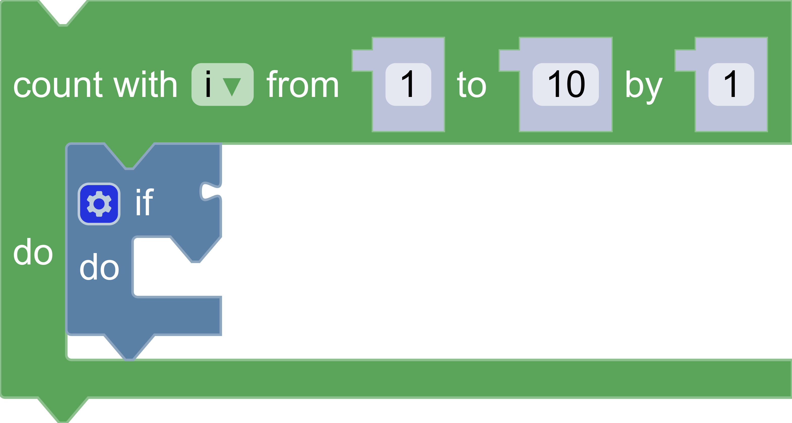

# Build custom renderers

## 1. Codelab overview

### What you'll learn

- How to define and register a custom renderer.
- How to override renderer constants.
- How to change the shape of connection notches.
- How to set a connection's shape based on its type checks.

### What you'll build

This codelab builds a custom renderer which adjusts renderer constants and uses different connection shapes depending on the input types.

The complete code used in this codelab can be viewed in the `blockly` repository under [packages/docs/docs/codelabs/custom-renderer](https://github.com/RaspberryPiFoundation/blockly/tree/main/packages/docs/docs/codelabs/custom-renderer/complete-code).

### What you'll need

- Basic understanding of renderers and toolboxes in Blockly.
- NPM installed ([instructions](https://docs.npmjs.com/downloading-and-installing-node-js-and-npm)).
- Comfort using the command line/terminal.
